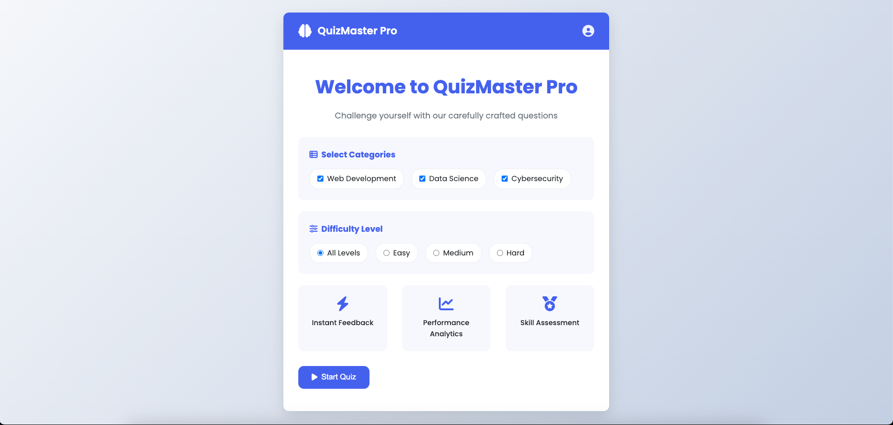

# QuizMaster Pro



## Overview

QuizMaster Pro is a modern, responsive quiz application built with vanilla JavaScript. This interactive quiz features multiple categories, difficulty levels, and provides instant feedback to users. The application showcases front-end development skills including DOM manipulation, event handling, animations, and responsive design.

## Features

- **Multiple Categories**: Choose from Web Development, Data Science, and Cybersecurity topics
- **Difficulty Levels**: Filter questions by easy, medium, or hard difficulty
- **Interactive UI**: Smooth animations and transitions enhance the user experience
- **Timer System**: Answer questions within a time limit for added challenge
- **Performance Analytics**: View detailed statistics about your quiz performance
- **Responsive Design**: Works seamlessly on desktop, tablet, and mobile devices
- **Confetti Celebration**: Visual feedback when answering correctly
- **Social Sharing**: Share your results with friends

## Technologies Used

- HTML5
- CSS3 (Custom properties, Flexbox, Grid, Animations)
- JavaScript (ES6+)
- Font Awesome for icons
- Google Fonts (Poppins)

## Development Highlights

### Dynamic Question Rendering

The application efficiently renders questions and answer options with smooth animations using JavaScript DOM manipulation:

```javascript
function showQuestion() {
  // Dynamically creates and animates answer buttons
  currentQuestion.answers.forEach((answer, index) => {
    const button = document.createElement("button");
    // Add staggered animation for a polished feel
    button.style.opacity = "0";
    button.style.transform = "translateY(20px)";
    
    setTimeout(() => {
      button.style.transition = "all 0.3s ease";
      button.style.opacity = "1";
      button.style.transform = "translateY(0)";
    }, 100 * index);
  });
}
```

### Performance Analytics

The application tracks user performance across categories and difficulty levels:

```javascript
// Analytics data tracking
let analytics = {
  categoryPerformance: {},
  difficultyPerformance: {},
  averageTimePerQuestion: 0,
  totalTimeTaken: 0,
  questionsAnswered: 0
};
```

### Confetti Animation

Custom particle animation system provides visual feedback for correct answers:

```javascript
function createConfetti(button) {
  // Creates animated particles originating from the correct answer
  for (let i = 0; i < 30; i++) {
    // Physics-based animation system
    animate(confetti, vx, vy, rotation, gravity, opacity);
  }
}
```

## Setup and Installation

1. Clone the repository:
```
git clone https://github.com/JosephDoUrden/quiz-game.git
```

2. Navigate to the project directory:
```
cd quiz-game
```

3. Open the index.html file in your browser or use a local server:
```
# Using Python
python -m http.server
```

## Future Enhancements

- User authentication system
- Persistent leaderboards
- Custom quiz creation
- Expanded question database
- Progressive Web App implementation

## License

MIT License

## Contact

Yusufhan Sacak - [yusufhansck@gmail.com](mailto:yusufhansck@gmail.com)

Project Link: [https://github.com/JosephDoUrden/quiz-game](https://github.com/JosephDoUrden/quiz-game)
